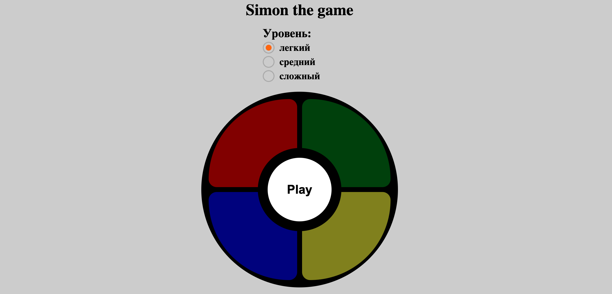

## Simon-the-game




### Link to the project: https://adzhigitovruslan.github.io/simon-the-game/

## Description

A great Simon game with its 4 big illuminated buttons, several difficulty Levels. Come and play the classic and famous Simon game!

## Tech stack

- JS
- SCSS
- HTML

## Project setup
```
npm install
```

### Compiles and hot-reloads for development
```
npm run serve
```

### Compiles and minifies for production
```
npm run build
```

### Lints and fixes files
```
npm run lint
```

### Customize configuration
See [Configuration Reference](https://cli.vuejs.org/config/).
